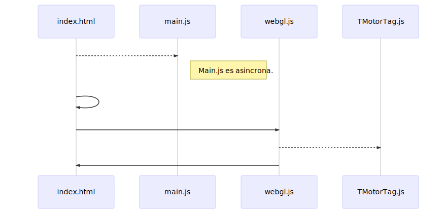

# TAG 2018/2019 - David y Javier v0.4

En este repositorio se guarda el proyecto de TAG de David y Javier de 4º curso de ingeniería multimedia. 
## Estructura del producto
### Funcionamiento

[](https://mermaidjs.github.io/mermaid-live-editor/#/edit/eyJjb2RlIjoic2VxdWVuY2VEaWFncmFtXG5pbmRleC5odG1sIC0tPj4gbWFpbi5qczogQ2FyZ2EgbG9zIGNvbnRyb2xlcyBiw6FzaWNvc1xuTm90ZSByaWdodCBvZiBtYWluLmpzOiBNYWluLmpzIGVzIGFzaW5jcm9uYS5cbmluZGV4Lmh0bWwgLT4-IGluZGV4Lmh0bWw6IMK_VGVybWluYWRvIGRlIGNhcmdhcj9cbmluZGV4Lmh0bWwgLT4-IHdlYmdsLmpzOiBDYXJnYSBsbyByZWxhY2lvbmFkbyBhbCBtb3RvciBncsOhZmljb1xud2ViZ2wuanMgLS0-PiBUTW90b3JUYWcuanM6IENhcmdhIGxvIGLDoXNpY29cbndlYmdsLmpzIC0-PiBpbmRleC5odG1sOiBIYWJpbGl0YXIgYm90w7NuIGVudmlhciIsIm1lcm1haWQiOnsidGhlbWUiOiJkZWZhdWx0In19)
### Archivos
[](https://mermaidjs.github.io/mermaid-live-editor/#/edit/eyJjb2RlIjoiZ3JhcGggTFJcbkFbSW5kZXguaHRtbF0gLS0-IEIoKG1haW4uanMpKVxuQSAtLT4gQyhXZWJHTC5qcylcbkMgLS0-IEQoVE1vdG9yVGFnKVxuRCAtLS0gRShUTm9kbylcbkQgLS0tIEYoVEdlc3RvclJlY3Vyc29zKVxuRCAtLS0gRyhURW50aWRhZClcbkQgLS0tIEgoVE1hbGxhKVxuRCAtLS0gSShUVHJhbnNmb3JtKVxuRCAtLS0gSihUQ2FtYXJhKVxuRCAtLS0gSyhUTHV6KSIsIm1lcm1haWQiOnsidGhlbWUiOiJkZWZhdWx0In19)
## Fases / Versiones
### Fase 0: Poner la base que el profesor nos da en los seminarios. 
PD: Las versiones coinciden con el número que hay en el seminario.
- 0.1 - Primera versión [David]
- 0.2 - Árbol de la escena [David]
- 0.3 - Gestor de recursos [David]
- 0.4 - Fachada [David]
### Fase 1: Revisar todo y realizar modificaciones conforme.
### Fase 2: Primer motor stable.
## Entorno de trabajo
### IDE
Recomendamos el uso de Visual Studio Code y cualquier IDE que sea capaz de detectar JSDoc y mostrarlo en la propia IDE.
### Git
Protocolo:
1. git pull, para tener el último posible.
2. Programar lo que creas, intentando en lo posible no crear conflictos.
3. git pull, por si alguien ha subido algo.
4. git commit + push, para subir tu trabajo.

Comentar que no se usarán ramas, por falta de conocimiento en el proceso de Merging, si aparece el problema de conflicto de código, tener mucho cuidado a la hora de hacer merge.

## Normas de programación
### Estándar

 - **_Variable** -> Variables teóricamente privadas
 - **VARIABLE** -> Constantes
 - Más de un nombre: **lowerCamelCase**.
 ### Documentación
 - Se utilizará la anotación de **JSDoc** para generar automáticamente la documentación:
 ```
 /**
* @summary Crea un nodo y lo relaciona con el nodo padre.
* @param  {TNodo}  padre El nodo padre.
* @param  {TEntidadd}  ent Una entidad.
* @return  {TNodo} El nodo resultante.
* @see  {@link  http://localhost:3000/pdf/S4.pdf#page=7 | S4.7}
* @author  David
* @version  0.4
* @todo  [motorTag] Crear Nodo
*/
```
- En la parte superior del fichero JS, es necesario anotar un resumen de lo que se ha hecho:
```
//===== Changelog ============================================
//= - 0.2 Init. S2.16 [David]
//= - 01/28 - Rafa recomienda el uso de la libreria GLM [David]
//= - 02/14 - Termina de transcribir lo que tenía de C++ a JS [David]
//============================================================
```
- Por tanto, si alguna vez existe una función/variable, de versión superior, a lo que hay escrito en el **Changelog** significa que el archivo no está terminado, así que no debe ser escrito por nadie a excepción del **Autor** de la versión superior.
- En caso de cambios puntuales o no relacionados con lo descrito en el plan de proyecto, se anotarán como revisiones de la versión que hay en ese momento.
- Es **Importante** saber que el **si la variable o función no lleva comentarios, se tomará como que el código no esta finalizado a la versión que se ha indicado**.
- El autor se cambiará cada vez que se aumente la versión.
